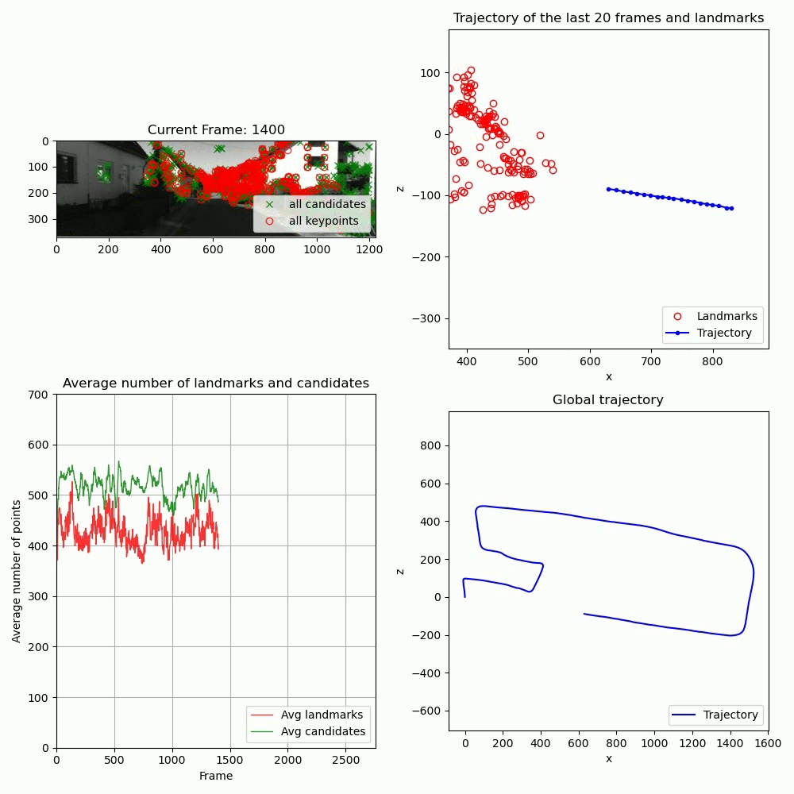

# A Visual Odometry Pipeline
A simple, monocular, visual odometry (VO) pipeline with the most essential features:
- **Initialization of 3D landmarks**  
- **Keypoint tracking** between consecutive frames  
- **Pose estimation** using 2D-3D correspondences  
- **Triangulation of new landmarks**  

The pipeline is designed to work with datasets like KITTI (05) and Malaga and can be extended to other datasets with minor adjustments.

---

## Datasets
The pipeline has been tested with the following datasets:

- **KITTI Odometry Dataset (Sequence 05)**
- **Malaga Stereo Urban Dataset**
- **Parking Dataset**

Which are all available on the course website [here](https://rpg.ifi.uzh.ch/teaching.html).

To use custom datasets, adjust the dataset loader in `dataset.py` to match your data structure.

---

## Installation
To set up the environment and install dependencies, follow the steps below:

### 1. Clone the Repository
```bash
git clone https://github.com/username/vo-pipeline.git
cd vo-pipeline
```
### 2. Set Up the Environment
An `environment.yml` file is provided to create the required Python environment using Conda.
Run the following command to create the environment:
```bash
conda env create -f environment.yml
```
Activate the environment:
```bash
conda activate vo-pipeline
```

---

## How to run
1. Extract the dataset (e.g., kitti05.zip) into the data folder:
```kotlin
data/
└── kitti/
    ├── 05
    ├── poses
```
2. Run `main.py`:
```bash
python main.py
```

---

## Visualization
A demo of the pipeline working with the three datasets can be found [here](https://www.youtube.com/watch?v=jwkrQaLIJNo&list=PLsmaGYpKB9GvD1bOp2xj7y9h44MYgsv36).
To create these visualizations, the visual odometry pipeline was run on a machine equipped with an Intel processor running at 4.2 GHz, 16 GB of RAM, and a multiprocessor configuration supporting multiple threads.

